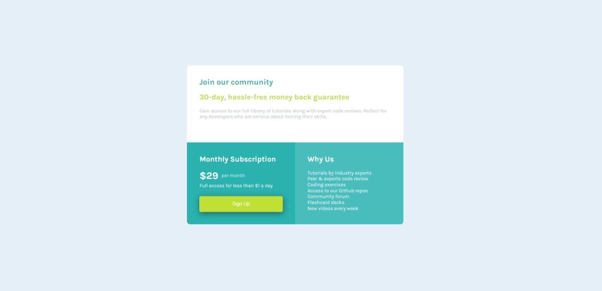

# Frontend Mentor - Single price grid component solution

This is a solution to the [Single price grid component challenge on Frontend Mentor](https://www.frontendmentor.io/challenges/single-price-grid-component-5ce41129d0ff452fec5abbbc). Frontend Mentor challenges help you improve your coding skills by building realistic projects. 

## Table of contents

- [Overview](#overview)
  - [The challenge](#the-challenge)
  - [Screenshot](#screenshot)
  - [Links](#links)
- [My process](#my-process)
  - [Built with](#built-with)
  - [What I learned](#what-i-learned)
  - [Continued development](#continued-development)
- [Author](#author)


**Note: Delete this note and update the table of contents based on what sections you keep.**

## Overview

### The challenge

Users should be able to:

- View the optimal layout for the component depending on their device's screen size
- See a hover state on desktop for the Sign Up call-to-action

### Screenshot




### Links

- Solution URL: [Add solution URL here](https://your-solution-url.com)
[Solution](single-price-grid-component-master.html)

## My process

### Built with

- Semantic HTML5 markup
- CSS custom properties
- Flexbox


### What I learned

Understanding the use of flex box and hover state when designing the web page.

```html
<h1>Some HTML code I'm proud of</h1>
```
```css
.container {
  width:350px;
  height: fit-content;
  margin-top: 100px;
}
```


### Continued development
I will continue to work and improve with projects allowing me to make use of flex box, grid and others.


## Author


- Frontend Mentor - [@chiwykes](https://www.frontendmentor.io/profile/chiwykes)


